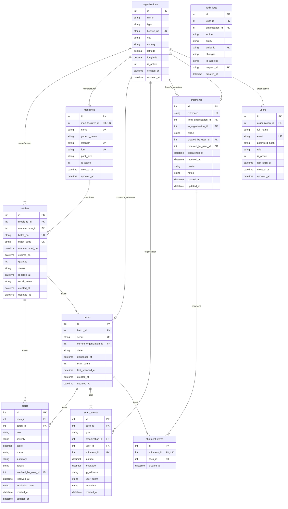

# Entity-relationship diagram

Generated from the live schema by `api/scripts/generate-erd.js`. Do not edit
by hand — regenerate it:

```bash
cd api && npm run docs:erd
```

A hand-drawn diagram is wrong within a week: someone adds a column and the
picture in the report keeps describing the database as it was in week three.
This one is read out of the tables the migrations produced, so it cannot drift.



## Tables

| Table | Rows in the development database |
| ----- | -------------------------------- |
| `alerts` | 166 |
| `audit_logs` | 581 |
| `batches` | 11 |
| `medicines` | 5 |
| `organizations` | 6 |
| `packs` | 936 |
| `scan_events` | 6,646 |
| `shipment_items` | 62 |
| `shipments` | 3 |
| `users` | 6 |

Row counts are whatever the local database happens to hold — they show the
shape of the demo data, not a property of the schema.

## Notes worth reading beside the diagram

- **`packs` is the table the project turns on.** One row per physical box, not
  per batch, which is what makes a duplicate scan evidence of a clone rather
  than ordinary traffic.
- **`scan_events` is append-only.** Never updated, never deleted. It is the
  regulator's trail, the customer's history, and the detector's training data
  at once.
- **`scan_events.organization_id` and `user_id` are nullable**, and that is
  load-bearing: a public verification has no actor, and their absence is a
  feature the model reads.
- **`alerts.pack_id` is nullable** so a batch-wide finding need not name a
  single pack.
- **`audit_logs` is written by a global Sequelize hook**, not by hand in each
  route, so tables added later are audited with no change to that code.

*Generated 2026-09-04.*
